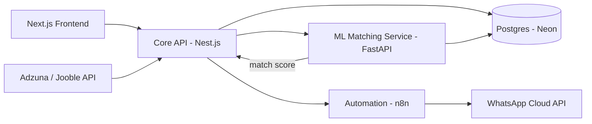

# Intermatch

An AI-powered job application portal that matches candidate resumes against job descriptions, scores the fit, and automatically guides candidates toward applying or upskilling — with WhatsApp notifications and aggregated listings from external job boards.

Built as a 3rd-year full-stack development course project, using an industry-aligned but lean, microservices-based stack.

---

## How It Works

1. **Recruiters** post jobs with a title, description, required skills, and category.
2. **Candidates** sign up, upload a resume, and select job categories they're interested in.
3. The **ML matching service** embeds both the resume and job description, computes a semantic similarity score, extracts skills, and combines both into a final match percentage.
4. Based on the score:
   - **80%+** → candidate receives a WhatsApp message with a direct apply link
   - **50–80%** → candidate is notified to update their resume/upskill, with missing skills listed, and still gets a chance to apply
   - **Below 50%** → no notification
5. A background job also pulls in listings from external job boards (Adzuna, Jooble) and feeds them through the same matching pipeline.

---

## Architecture



This is a **microservices setup split across 4 repositories**, one per module:

| Repo | Responsibility | Deploys to |
|---|---|---|
| `frontend` | Candidate & recruiter UI | Vercel |
| `core-api` | Auth, jobs, applications, orchestration | Render |
| `ml-service` | Resume-JD matching (embeddings + scoring) | Render |
| `automation` | WhatsApp notifications, job aggregation | n8n |

---

## Tech Stack

- **Frontend:** Next.js (App Router), Tailwind CSS
- **Auth:** Clerk
- **Core Backend:** Nest.js, Drizzle ORM
- **Database:** PostgreSQL (Neon) with `pgvector`
- **ML Service:** FastAPI, `sentence-transformers`, spaCy
- **Automation:** n8n, WhatsApp Cloud API (Meta)
- **External Job Data:** Adzuna API, Jooble API
- **Package Manager:** pnpm
- **CI/CD:** GitHub Actions
- **Deployment:** Vercel (frontend), Render (backend services)

---

## Repository Structure (this repo: `frontend`)

```
frontend/
├── app/
│   ├── auth/
│   │   ├── sign-in/
│   │   └── sign-up/
│   └── dashboard/
│       ├── candidate/
│       │   └── resume/
│       └── recruiter/
│           └── jobs/
├── components/
│   ├── ui/
│   └── forms/
├── lib/
└── public/
```

---

## Getting Started

```bash
git clone <this-repo-url>
cd frontend
pnpm install
pnpm dev
```

Open [http://localhost:3000](http://localhost:3000) to view it locally.

Environment variables required (see `.env.example`):
```
NEXT_PUBLIC_CLERK_PUBLISHABLE_KEY=
CLERK_SECRET_KEY=
NEXT_PUBLIC_CORE_API_URL=
```

---

## Branching Strategy

- `main` — active development, PRs from forks merge here
- `staging` — pre-release testing, auto-deploys to a staging environment
- `production` — live deployment

---

## Related Repositories

- [`core-api`](#) — Nest.js backend
- [`ml-service`](#) — FastAPI matching service
- [`automation`](#) — n8n workflows and integrations

---

## Team

4-member team, 3rd-year full-stack development course project.